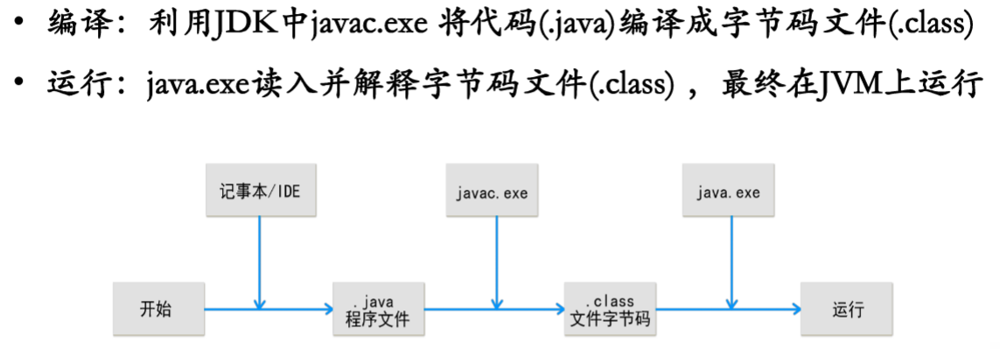

## Java 的编译与运行  
  
`.java`--javac.exe-->`.class`--java.exe-->RUN  
  
  
### Java 编译
javac.exe对.java文件
`javac HelloWorld.java`  
`javac ...详细路径\HelloWorld.java`  
  
### Java 运行
java.exe对.class文件，不过不带`.class`。  
`java HelloWorld`  
`javac ...详细路径\HelloWorld`
