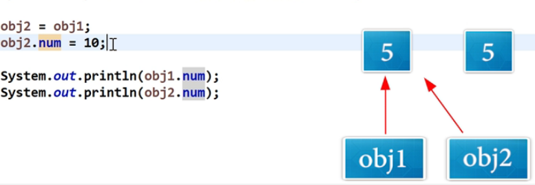
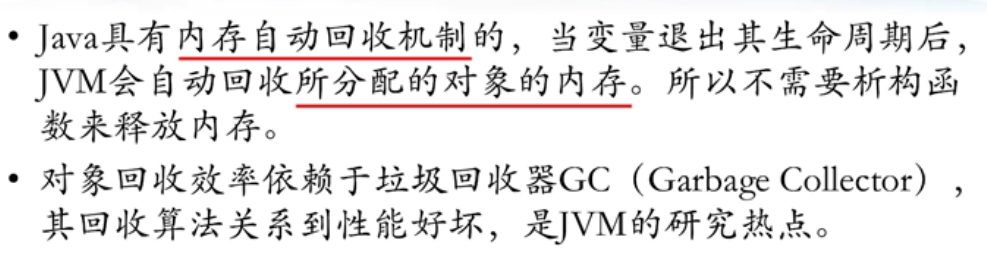

## 基本类型赋值和对象赋值
基本类型的赋值是值的拷贝，二者独立；对象的赋值是引用的赋值，二者共享同一段内存区域。  
函数的形参传递时也是用的赋值，即函数`func(x)`执行`func(a)`会进行赋值`x=a`。  
因此，对于swap函数，`swap(int a, int b)`是不会交换的，而`swap(Obj a, Obj b)`是会交换的.  

  
## 类型的默认值
在Java的类中，可以直接指定成员变量的默认值：
```java
public class Obj {
    int a = 10;
}
```
而如果不指定，则**类中的成员变量**会自动初始化为规定的默认值`0`，而**函数内的局部变量**是不会自动初始化的，直接使用会报错。  
  
## 构造函数
对象的创建：  
```java
Obj obj1 = new Obj();
Obj obj2 = new Obj(10);
```
  
## Java没有析构函数
通过`new`创建的对象会由系统自动回收，类中没有析构函数。
`new`创建的对象的生命周期只在包含它的最近的一个大括号`{}`里。
  
  
## `this`
java的this跟C++的this还是不同的.  
```cpp
void Obj::set(int a)
{
    this->a = a;
}
```
```java
public class Obj {
    private int a;

    public void set(int a) {
        this.a = a;
    }
}
```
  
同时，`this`还可以用来在该类的某一个构造函数中调用该类的另一个构造函数。  
但通过`this`调用同一类的构造函数的语句需要放在第一条。  
```java
public class A {
    public A () {
        age = 0;
        height = 0;
    }

    public A (int age) {
        this();     //调用上面那个构造函数
        this.age = age;
    }

    private int age;
    private int height;
}