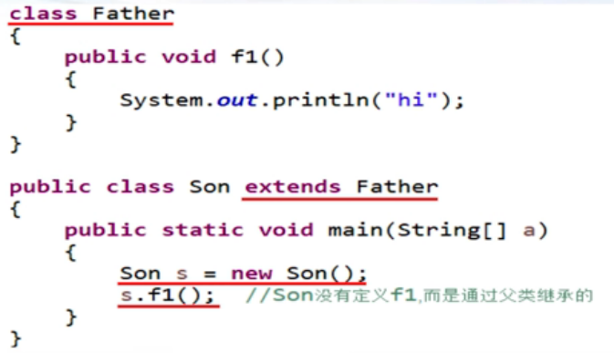

## 继承
1. 关键字
   `extends`  
     
     
2. 单根继承原则
   Java中每个类只能继承自一个父类，而C++可以继承自多个父类。  
     
3. Java类默认继承java.lang.Object类
   即所有的类都直接或间接地继承自`java.lang.Object`类，并从该类开始，构建出一个类型继承树。  
   `java.lang.Object`类中默认有clone, equals, finalize, getClass, hashCode, toString等方法。  
     
4. 子类的构造函数的第一条指令默认隐含着`super()`，即调用父类的无参构造函数，因此已经在父类的构造函数中初始化的变量在自类中就不需要再次修改了。  
   由于是无参构造函数，因此如果没有无参构造函数，则会报错。  
   或者是手动`super()`调用父类中指定的构造函数，但必须放在子类构造函数的第一条。  
     
5. 关于super
   类似于this, `super`是父类对象的引用，因此可以：
   1. 类似this，用来直接引用父类的变量。  
   2. 当变量名发生冲突时，可以指明来区分父类还是自类的变量/函数。  
   3. `super()`调用父类的构造函数。  
  
  