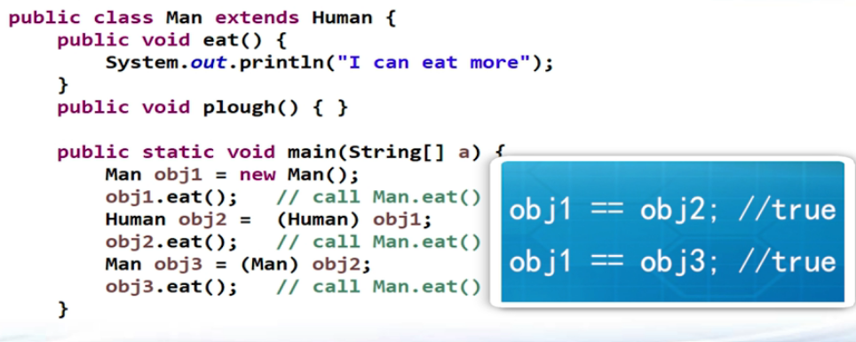

## 类转型
1. 子类对象可以转为父类，而父类对象不能转为子类。  
    ```java
    Father f = new Son();
    Son s = new Father();   //error
    Son s2 = (Son) f;       //runtime correct
    ```
    父类对象转为子类当且仅当父类对象本身就是从子类对象转过去的。  
  
## 多态
1. 子类可以重新定义从父类继承的方法，叫**重写(overwrite/override)**，而不是重载(overload).  
2. 子类对象转型后赋值给父类（引用），其调用的函数仍然是子类中的函数。  
     
3. 作用：
   - 以统一的接口来操纵某一类中不同的对象的动态行为。  
   - 对象之间的解耦。  